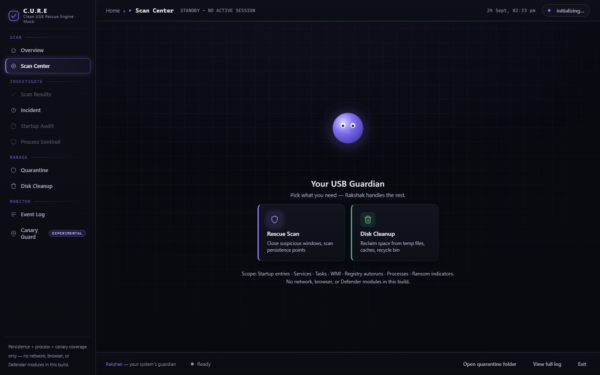

# C.U.R.E. — Clean USB Rescue Engine

[](https://github.com/MadB0i/C.U.R.E/actions/workflows/ci.yml)

**A local-first Windows tool that finds how software persists on your PC, shows the evidence, and removes nothing without your explicit say-so.**




## Why it exists

Malware that survives a reboot hides in startup folders, Run keys,
scheduled tasks, services, and WMI subscriptions. C.U.R.E inspects those
mechanisms, risk-scores every finding **with its evidence attached**, and
lets you quarantine files (never delete) with a recorded, scoped undo —
or tells you exactly which manual backup-first steps to take for things it
will never touch automatically (registry, services, WMI).

## How it works

```
scan      → collectors read persistence locations (nothing is changed)
score     → heuristics + Authenticode + local hash IOCs → risk + reasons
YOU CLICK → Start Rescue, per-item confirm, or --yes (never automatic)
quarantine→ recorded move to quarantine/ (+ ACL snapshot) …
undo      → … restored byte-identical, ACLs included, or a fidelity note
```

It is evidence-first: nothing is remediated on the basis of a score
alone. It is a diagnostic instrument, not an antivirus: no guaranteed
malware detection, no real-time protection, no cloud threat intelligence,
no automatic malware removal.

## Key design principles

- **No auto-scan.** Every run starts with one explicit click or command.
- **User control.** Destructive actions confirm per item; non-interactive
  sessions refuse instead of guessing.
- **Local-only, no network by default.** No telemetry, no accounts, no
  threat lookup. Certificate revocation is cache-only unless you pass
  `--online-revocation`.
- **Move, never delete.** Quarantine relocates with size+hash integrity
  checks and restores ACLs/timestamps; orphans are reported, never purged.
- **Honest limits.** Uncheckable areas render as INCOMPLETE, never "clean".
  The Canary Guard is an experimental tripwire, not protection.

## Security model / threat model

What is trusted:

- The rescue USB **you prepared** and the host-installed copies it pins on
  first consented run (`%LOCALAPPDATA%\CURE\cure-gui.exe`, pinned by
  SHA-256; the watcher launches nothing else, ever).
- Your own explicit confirmations (Start Rescue click, `[y/N]` prompts,
  `--yes` flags, per-window overlay Close buttons). Nothing destructive
  runs without one.

What is NOT trusted:

- Any other USB stick, including its `.cure-trigger` file and any
  executables it carries. A copied trigger without this machine's pairing
  token is ignored; a drive-supplied binary is never executed — verified
  live with a swapped-exe test (see `docs/validation/REAL-PC-VALIDATION.md`).
- Data from the scanned machine: file names, registry values, task XML,
  and window titles are attacker-controlled input. They are displayed
  escaped (never executed, never passed to a shell) and scores treat them
  as evidence, not verdicts.

Overlay windows: candidates are **shown** (process, path, PID, signature,
size, monitor coverage) and each close is a separate click — graceful
`WM_CLOSE` by default, process termination only via an explicit per-window
Force-close. Matching additionally requires ≥90% monitor coverage plus a
path+hash user allowlist. Known surface: a *fullscreen*, unsigned,
borderless, topmost window (unsigned game, AHK tool, installer splash) is
still *shown* for your judgement — see the honest-limits note in
`testing/real-pc/README-TESTING.md`.

Cooperative vs enforced: quarantine/undo integrity (pending records,
atomic saves, hash checks) is **enforced** by the engine. Stopping malware
that is already running as your user is **not** — same-user code execution
is outside what any user-space scanner can enforce, and C.U.R.E does not
claim otherwise.

## Install / run / uninstall

No installer, no admin needed for the core flows (scanning HKLM areas and
the Task Scheduler root show INCOMPLETE rows instead when unelevated).

```bat
:: CLI
cure.exe --data-dir .\cure-data scan
cure.exe --data-dir .\cure-data quarantine <id>     :: asks first
cure.exe --data-dir .\cure-data undo <id>

:: Desktop UI (needs WebView2, preinstalled on modern Windows)
cure-gui.exe

:: Watcher: first run asks Yes/No, then watches for paired USBs
cure-watch.exe
cure-watch.exe pair E:
cure-watch.exe --uninstall --dry-run
cure-watch.exe --uninstall          :: asks first; ends with clean/leftovers
```

## Build from source

```bat
cargo build --release        :: cure.exe + cure-watch.exe (root workspace)

cd gui\src-tauri
cargo build --release        :: cure-gui.exe (GUI workspace)
```

Requires Windows 10/11 with WebView2 (preinstalled on modern systems).

## Testing

```bat
cargo test --workspace
cargo clippy --workspace --all-targets -- -D warnings
cargo fmt --check

cd gui\src-tauri
cargo test                   :: headless-safe GUI tests (one desktop test is #[ignore]d)
```

Counts move with every fix, so they are not hardcoded here — the CI badge
at the top is authoritative. The `#[ignore]`d overlay test needs an
interactive desktop: `testing\run-gui-desktop-tests.bat`.

## Validation status

From `docs/validation/REAL-PC-VALIDATION.md` (real Windows 11 PC,
standard user, 2026-09-24). Nothing below is claimed beyond that report.

| Area | Verified live | Unit-tested | Code-verified only | Not validated |
|---|---|---|---|---|
| Scan detects Run/Startup persistence + risk levels | ✓ | ✓ | | |
| Registry guidance-only (never moved) | ✓ | | | |
| Quarantine move + record | ✓ | ✓ | | |
| Undo byte-identical + ACL restore | ✓ | ✓ | | |
| Dry-run / unknown-id / double-undo errors | ✓ | ✓ | | |
| Non-TTY refusal (exit 1, untouched) | ✓ | ✓ | | |
| Watcher consent, pairing, token rows, swapped-exe never launched | ✓ | ✓ | | |
| `cure-watch --uninstall` + clean verify | ✓ | ✓ | | |
| Overlay matcher (coverage gate, allowlist, attribution) | | ✓ | | |
| Overlay card / close / force / allowlist loop (live UI) | | | | ✓ |
| Revocation UNVERIFIED state | | ✓ | | |
| Cold-cache revocation, elevated scans | | | | ✓ |
| `cleanup run`, DISM | | | | ✓ |
| Real-malware canary | | | | ✓ (synthetic by design) |
| GUI fully offline (no remote URLs) | | | ✓ (grep + CI gate) | |
| Scoring weights, WMI/service/error paths | | ✓ | | |

## Project structure

```
core/            scanners, scoring, quarantine/undo, reports, signatures
cli/             cure.exe
watch/           cure-watch.exe (USB pairing, launch, canary, uninstall)
winwatch/        shared directory watching + decoy planting
gui/             Tauri v2 frontend (dist/ ships offline; index.dev.html = mock)
testing/         fake-overlay fixture · real-pc/ live kit · vm-stage/ VM harness
tools/docs-capture/  isolated Playwright screenshot/demo tooling
docs/            screenshots/ · media/ · validation/ · ARCHITECTURE.md
```

See `docs/ARCHITECTURE.md` (one page) and `testing/real-pc/README-TESTING.md`
(manual checklist) for more.

## Limitations / roadmap

- Needs elevation for HKLM areas and the Task Scheduler root (reported as
  INCOMPLETE, never silent).
- IOC feed is a labeled DEMO fixture; a signed-feed provider is future work.
- No Winget/store installer yet; no signed binaries shipped.
- Overlay live loop, cold-cache revocation, and USB-passthrough timing
  still want an isolated box (see the validation report).

## License

MIT — see [LICENSE](LICENSE).
