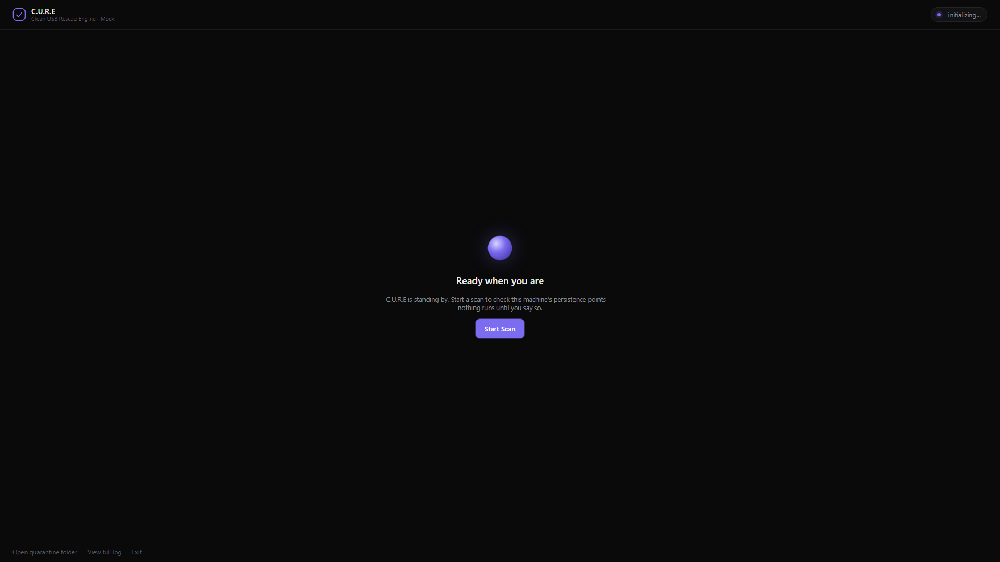
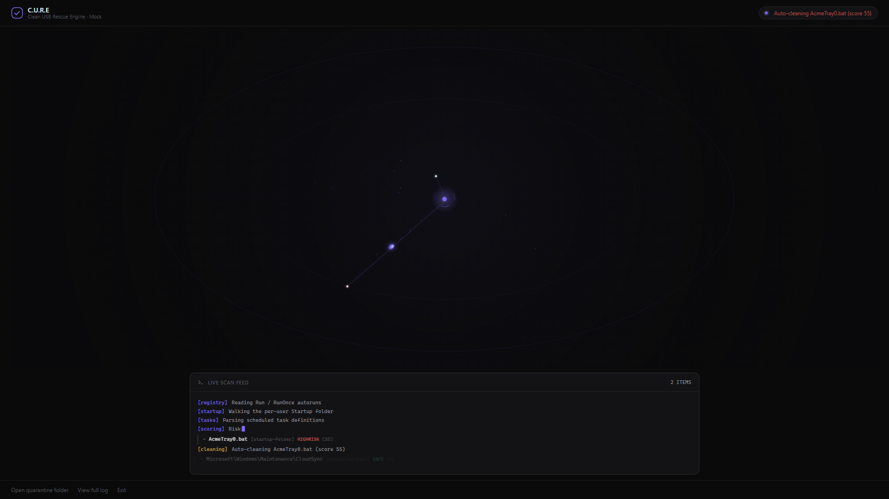
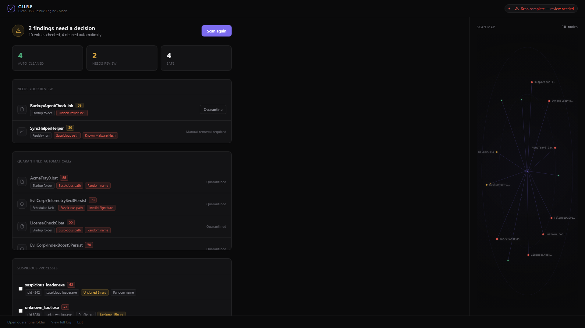
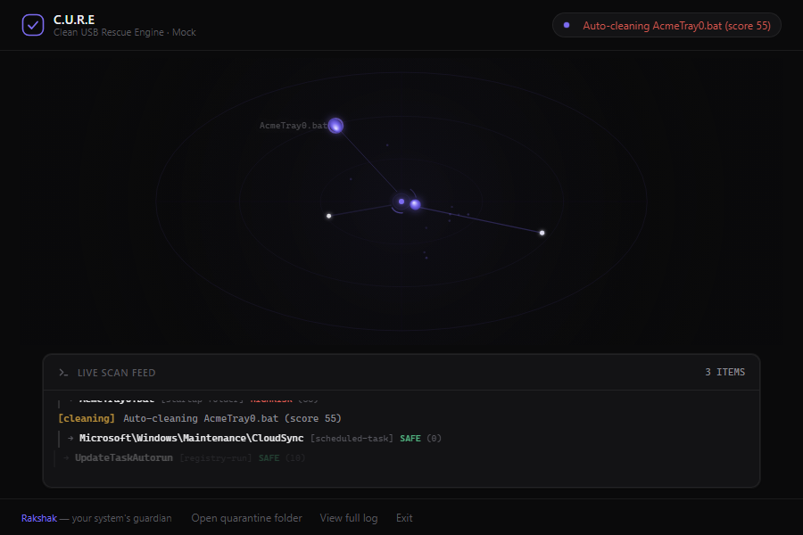
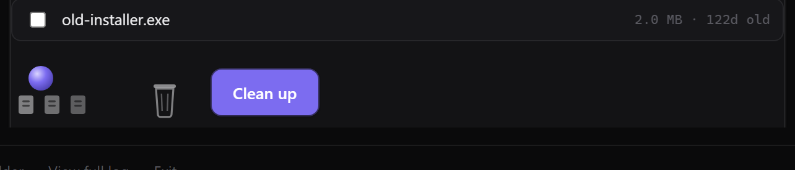

# C.U.R.E — Clean USB Rescue Engine

[](https://github.com/MadB0i/C.U.R.E/actions/workflows/ci.yml)
[](LICENSE)
[](https://www.rust-lang.org/)
[](#)
[](#)
[](https://tauri.app/)

A portable, install-free Windows security toolkit that finds the most common
ways malware survives a reboot, risk-scores every finding, and lets you
**quarantine (never delete)** anything malicious — without touching your
documents.

<kbd></kbd>

### See it in action

<kbd></kbd>

## Why C.U.R.E

Windows persistence malware hides in places most toolkits skip — autoruns,
startup folders, scheduled tasks. C.U.R.E sweeps all of them, scores each
entry, and surfaces a clear **"keep or quarantine"** decision. It is designed
around one rule:

> **Nothing is scanned, cleaned, or deleted until *you* press a button.**
> Quarantine is always a *move*, never a delete, and every action has an exact undo.

When you press **Start Rescue**, C.U.R.E first closes suspicious fullscreen
lock windows (borderless, topmost windows from unsigned processes — the classic
ransom-screen pattern), then scans every persistence point on the machine.

## Quick start

### 1. Download
Grab the latest `cure-gui.exe` (+ optional `cure-watch.exe`) from the
[Releases page](https://github.com/MadB0i/C.U.R.E/releases). No install needed.
Requires only Windows 10/11 with WebView2 (preinstalled on modern systems).

### 2. Or build it
```bat
cargo build --release        :: cure.exe + cure-watch.exe
cargo test  --workspace      :: 159 tests, engine + watcher

cd gui\src-tauri
cargo build                  :: cure-gui.exe
```

### 3. Make a rescue USB
```bat
copy cure-gui.exe E:\
echo CURE-TRIGGER-V1> E:\.cure-trigger
```
Plug the stick into any PC, run `cure-gui.exe`, press **Start Rescue**.
With `cure-watch.exe` running, the GUI auto-launches the moment a rescue USB is
inserted — zero-click.

## Features

| Area | What it does |
|---|---|
| **Persistence scan** | Registry `Run\RunOnce`, Startup folder (all users), Scheduled Tasks — mapped to MITRE ATT&CK (T1547.001, T1053.005) |
| **Risk scoring** | Weighted model: drop-zone paths +30, trusted system paths −20, randomized names +25, hidden PowerShell +25, valid Authenticode −40, invalid signature +40, known-hash match = forced HIGH-RISK |
| **Quarantine + Undo** | Every action is a JSON-recorded move into quarantine, with exact `undo` |
| **Overlay dismissal** | Detects and closes ransom-screen style fullscreen lock windows before scanning |
| **Ransomware Canary Guard** | Writes bait files in watched dirs; any edit/encrypt of a canary triggers an alert + tripwire |
| **Process sweep** | Finds suspicious running processes (unsigned, drop-zone paths), lets you kill high-risk ones |
| **Threat intel** | SHA-256 / IP / domain IOC matching + lookup against MITRE ATT&CK technique mapping |
| **Disk Cleanup** | Separate flow: temp files, browser caches, Recycle Bin, Windows.old, old installers (~GBs of reclaimable space) — explicit confirm only |
| **0-click USB watch** | `cure-watch` polls for a trigger stick and brings the GUI to front automatically |

## Screenshots

| Scan in progress | Results & review |
|---|---|
|  |  |

| Ransomware canary alert | Disk cleanup |
|---|---|
|  |  |

## Architecture

```
cure/
├── core/     cure_core — shared engine: scanners, risk.rs, baseline diffing,
│             quarantine, canary, threat-intel IOC store, MITRE ATT&CK mapping
├── cli/      cure.exe — scan / diff / quarantine / undo / cleanup from any terminal
├── watch/    cure-watch.exe — USB-trigger auto-launcher for the GUI
└── gui/      cure-gui.exe — Tauri v2 + animated front-end (Rakshak mascot)
```

| Where | Tech |
|---|---|
| Engine | Rust — WinReg, `windows` crate (WinTrust/Authenticode), walkdir, sha2 |
| Desktop UI | Tauri v2 (WebView2), vanilla JS + Canvas |
| Quality | 159 tests, `cargo clippy -- -D warnings`, CI on GitHub Actions, Playwright UI harness |

## CLI usage

```bat
cure.exe scan --data-dir E:\cure-data
cure.exe diff --data-dir E:\cure-data          :: what changed since last scan
cure.exe quarantine <id> --data-dir E:\cure-data
cure.exe undo <id>       --data-dir E:\cure-data

cure.exe cleanup scan
cure.exe cleanup run [--include-downloads] [--dism]
```

## Safety model

- Quarantine is always a **move**, never a delete — every action has a JSON
  record and an exact `undo`.
- Only reads/writes inside scanned persistence locations plus its own data dir.
  Never touches Documents/Downloads/Desktop unless you ask.
- Registry autoruns are **read-only** (detected + scored, not modified) —
  surfaced for manual review.
- No silent background scanning. The watcher only polls drive letters and
  brings the window to front.

## Roadmap

- [ ] Ed25519-signed trigger files (authenticate trusted rescue USBs)
- [ ] Service / WMI subscription / IFEO / COM hijack scanners
- [ ] Live threat-feed sync for the IOC store
- [ ] Publisher/certificate extraction (beyond verdict-only Authenticode)
- [ ] Startup `.lnk` target resolution + full task-XML command parsing

## Known limitations

- Trigger file isn't cryptographically signed yet (on the roadmap above)
- Signature check is verdict-only — no publisher/certificate extraction yet
- Hash-intel list is a small compiled-in demo seed, not a live feed

## License

MIT — see [LICENSE](LICENSE).