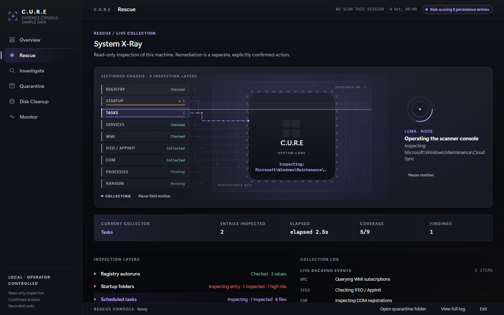
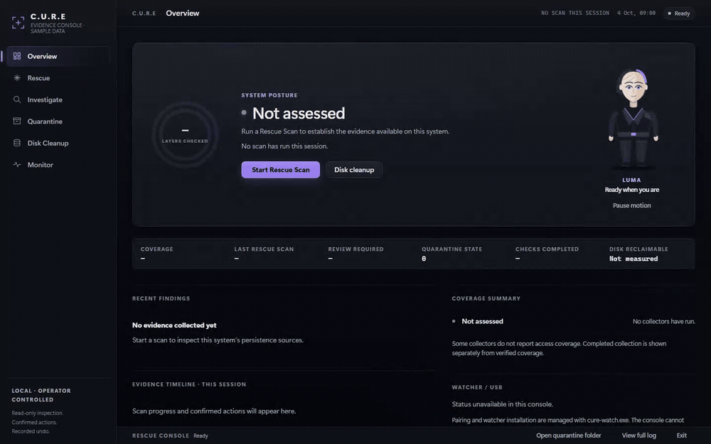
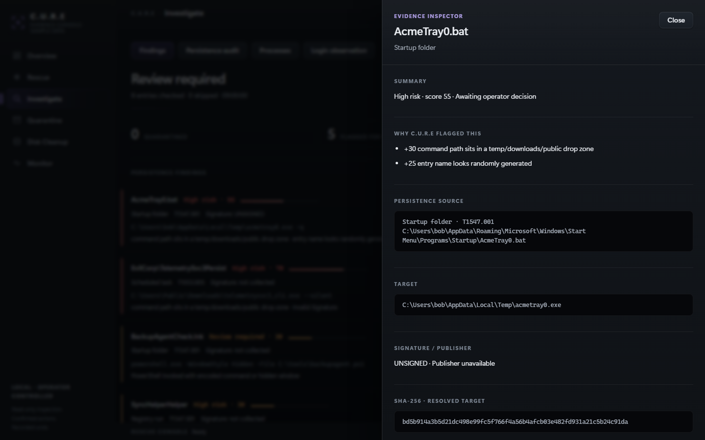
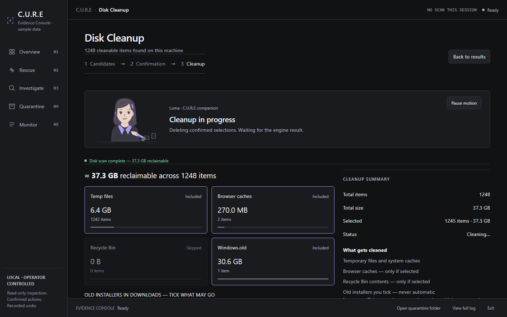
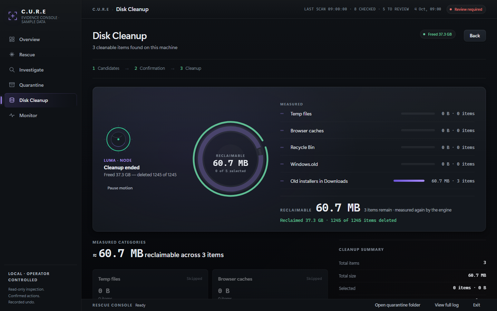
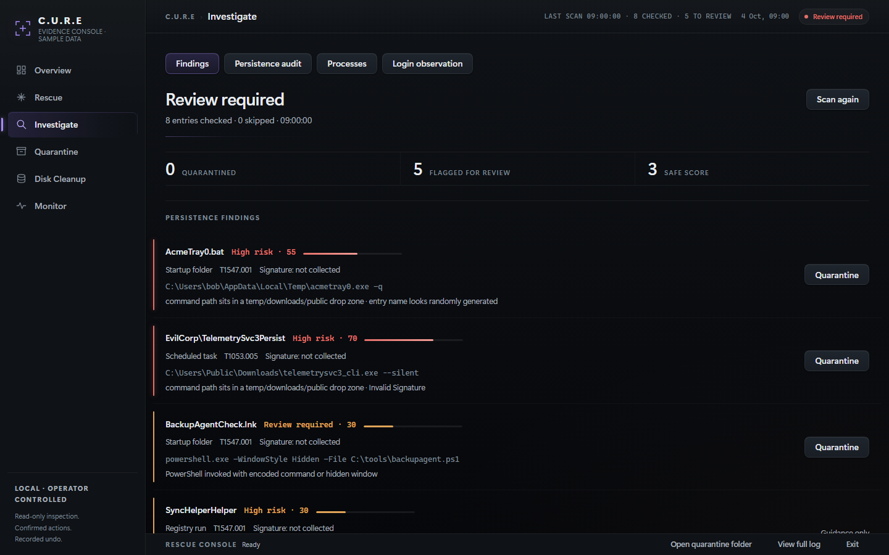

# C.U.R.E

### Evidence-first Windows rescue and persistence inspection.

C.U.R.E shows what starts with Windows, why it was flagged,
and what will change before you act.

[](https://github.com/MadB0i/C.U.R.E/actions/workflows/ci.yml)



- Inspect Windows persistence points and suspicious processes.
- Review evidence before taking action.
- Quarantine supported files with integrity-checked undo.



[Watch the same flow as MP4](docs/media/demo.mp4) · [WebM](docs/media/demo.webm)

Malware that survives a reboot hides in startup folders, Run keys, scheduled
tasks, services and WMI subscriptions. C.U.R.E reads those mechanisms, scores
every finding **with its evidence attached**, and moves — never deletes —
files you confirm, with a recorded, byte-identical undo. Anything it will not
touch automatically, such as the registry, is reported as guidance instead.

## What it inspects

| Layer | What C.U.R.E reads |
|---|---|
| Registry | Run/RunOnce keys, Startup folders — **guidance only, never modified** |
| Startup | Startup folders and shortcuts |
| Tasks | Scheduled task definitions and actions |
| Services | Service image paths and descriptions |
| WMI | Event subscriptions and permanent consumers |
| IFEO | Image File Execution Options debugger entries |
| COM | Hijackable COM registrations |
| Processes | Running process list and command lines |
| Disk Cleanup | Temp files, browser caches, Recycle Bin, `Windows.old` |

Scoring is heuristic: Authenticode status, path reputation, LOLBin shapes and
local indicators, each with the reason shown beside it. Treat Suspicious and
High as investigation leads, not verdicts.

## Screenshots

| | |
|---|---|
|  |  |
| **Evidence inspector** — why it was flagged, and what it points at. | **Disk Cleanup** — measured first, deleted only after you confirm. |
|  |  |
| **Cleanup result** — the receipt is the engine's own, not an estimate. | **Review required** — every finding carries its score and reason. |

All screenshots and demo media use labelled mock sample data.

## Download

The published release is **v0.1.0**. v0.2.0 is prepared and awaiting release.

[**Releases**](https://github.com/MadB0i/C.U.R.E/releases/latest)

Each release archive contains:

| File | What it is |
|---|---|
| `cure-gui.exe` | Desktop Rescue Console (Tauri, needs WebView2) |
| `cure.exe` | CLI scanner, quarantine and undo |
| `cure-watch.exe` | USB watcher: consent, pairing, launch, uninstall |
| portable ZIP | The above, no installer |
| `SHA256SUMS.txt` | Hashes for the archive contents |

Windows 10/11 with WebView2 (preinstalled on current Windows). **Binaries are
currently unsigned.** No installer and no administrator rights are needed for
the core flows; unelevated scans show INCOMPLETE rows instead of guessing.

```bat
cure.exe --data-dir .\cure-data scan
cure.exe --data-dir .\cure-data quarantine <id>     :: asks first
cure.exe --data-dir .\cure-data undo <id>
```

## Safety and limitations

**C.U.R.E is a diagnostic and rescue tool. It is not an antivirus or an EDR.**
It does not guarantee malware detection, provides no real-time protection, and
will not make an infected machine safe on its own.

- **Nothing runs without you.** No auto-scan: every run starts with one
  explicit click or command. Non-interactive sessions refuse rather than guess.
- **Local only.** No telemetry, no accounts, no cloud lookups. Certificate
  revocation is cache-only unless you pass `--online-revocation`.
- **Move, never delete.** Quarantine relocates with size and hash integrity
  checks, snapshots ACLs, and restores byte-identical — or reports exactly what
  could not be restored.
- **Honest gaps.** Areas that could not be read render as INCOMPLETE, never as
  "clean". Disk Cleanup is the one permanent deletion, and it is a separate,
  explicitly confirmed action.
- **Scoring is heuristic.** Novel attacker patterns outside the known list can
  score Safe. `%VAR%` expansion depends on the process environment.
- **Same-user code execution is out of scope.** Stopping malware already
  running as your user is not enforced by any user-space scanner.

## Build and validate

```bat
cargo build --release        :: cure.exe + cure-watch.exe
cd gui\src-tauri
cargo build --release        :: cure-gui.exe

cargo test --workspace
cargo clippy --workspace --all-targets -- -D warnings
cargo fmt --check
```

The GUI ships an offline, framework-free frontend and has deterministic
state, accessibility, keyboard, layout, reduced-motion and pixel checks that
use mock data and change nothing on the host:

```powershell
python -m pip install -r gui/devtools/requirements.txt
python -m playwright install chromium
cd gui/devtools
npm ci && npm test && npm run layout && npm run pixel
```

## Documentation

[Release notes](docs/RELEASE-NOTES-0.2.0.md) ·
[Release readiness](docs/RELEASE-READINESS-0.2.0.md) ·
[Visual verification](docs/UI-REDESIGN-VERIFICATION.md) ·
[Architecture](docs/ARCHITECTURE.md) ·
[GUI verification](gui/devtools/README.md) ·
[Real-PC validation report](docs/validation/REAL-PC-VALIDATION.md) ·
[Manual test checklist](testing/real-pc/README-TESTING.md) ·
[Security policy](SECURITY.md)

## License

MIT — see [LICENSE](LICENSE).